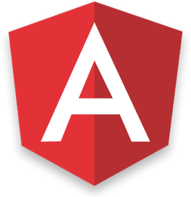

<h2 align="center">
  ✨ Tutorial blog posts with **complete runnable code** ✨
</h2>

Written by <a href="https://fullstack.io">Fullstack.io</a> and <a href="#contributors">friends</a>

🚀 Introduction
=================

This repository is a collection of tutorials, blog posts, and code that teach fullstack web development topics.

The code and posts are from the blogs: 

* [Fullstack Vue](https://medium.com/fullstackio/)
* [Fullstack React](https://fullstackreact.com/)
* [ng-book](https://blog.ng-book.com)

Vue
=================

## Articles
* 💠 <strong><a href="https://medium.com/fullstackio/managing-state-in-vue-js-23a0352b1c87" target="_blank">Managing State in Vue.js</a></strong> ([Source](./vue/managing_state_01/))
* 📷 <strong><a href="https://medium.com/fullstackio/tutorial-build-an-instagram-clone-with-vue-js-and-cssgram-24a9f3de0408" target="_blank">Tutorial - Build an Instagram clone with Vue.js and CSSGram</a></strong> ([Source](./vue/instagram_clone_02/))

Read more on <a href="https://www.fullstack.io/vue/" target="_blank">Fullstack Vue</a>

Angular
=================

## Articles
* 👷<strong><a href="http://blog.ng-book.com/service-workers-and-angular/" target="_blank">The Beginners Guide to Service Workers and Angular</a></strong> ([Source](./angular/service-workers/))

Read more on <a href="https://blog.ng-book.com" target="_blank">ng-book blog</a>

## Contributors

<!-- ALL-CONTRIBUTORS-LIST:START - Do not remove or modify this section -->
<!-- prettier-ignore -->
| <a href='https://newline.co'><h4 align='center'><a href='https://newline.co'>Nate Murray</a></h4> | <a href='http://www.hassandjirdeh.com'><h4 align='center'><a href='http://www.hassandjirdeh.com'>Hassan Djirdeh</a></h4> | <a href='https://github.com/MarinkoSpasojevic'><h4 align='center'><a href='https://github.com/MarinkoSpasojevic'>MarinkoSpasojevic</a></h4> | <a href='https://github.com/chuckeles'><h4 align='center'><a href='https://github.com/chuckeles'>Martin Jakubik</a></h4> | <a href='#'><h4 align='center'><a href='#'>and you?</a></h4> |
| :---: | :---: | :---: | :---: | :---: |
<!-- ALL-CONTRIBUTORS-LIST:END -->

