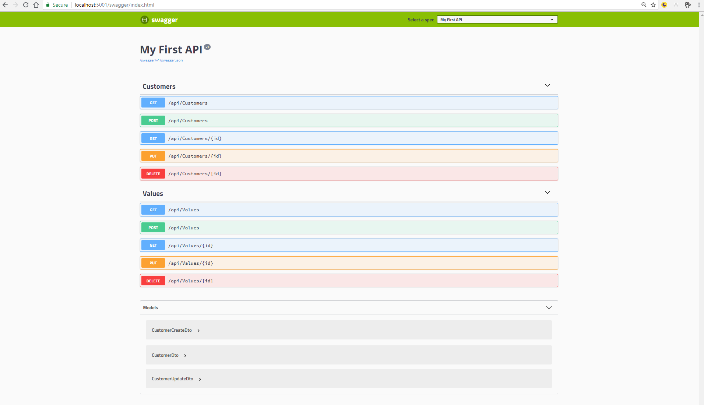
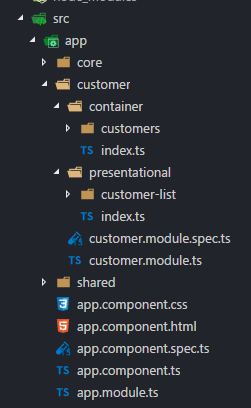
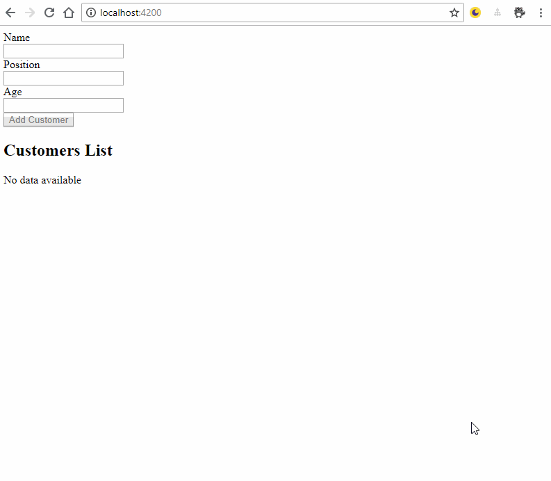

# Getting started with Angular and ASP.NET Core step by step

Building distributed systems nowadays is challenging and uses a lot of tools and frameworks for the frontend and backend.

In this article I want to describe the first steps to get started with **ASP.NET Core**, the **.NET CLI**, **Angular**, and the **AngularCLI**.

## Outline

What we will cover:

1.  [Creating an ASP.NET Core WebAPI with the .NET CLI](#creating-an-aspnet-core-webapi-with-the-net-cli)
2.  [Preparations and using the Dependency Injection](#preparations-and-using-the-dependency-injection)
3.  [Adding a Controller](#adding-a-controller)
4.  [Implementing CRUD Operations](#implementing-crud-operations)
5.  [Adding Swagger to you API](#adding-swagger-to-you-api)
6.  [Adding Versioning to your API](#adding-versioning-to-your-api)
7.  [Adding CORS to our API](#adding-cors-to-our-api)
8.  [Scaffold the client side application with the AngularCLI](#scaffold-the-client-side-application-with-the-angularcli)
9.  [Structure your Angular App](#structure-your-angular-app)
10. [Thoughts about our application structure](#thoughts-about-our-application-structure)
11. [Create a core module, a data service and requesting data from the server via http](#create-a-core-module-a-data-service-and-requesting-data-from-the-server-via-http)
12. [Create a feature module with presentational and container components](#create-a-feature-module-with-presentational-and-container-components)
13. [Display data in your HTML-Templates via Databinding](#display-data-in-your-html-templates-via-databinding)
14. [Sending data to the server](#sending-data-to-the-server)
15. [Adding a details page with routing](#adding-a-details-page-with-routing)

Let's get started!

## Creating an ASP.NET Core WebAPI with the .NET CLI

As a first step, you can download the .NET CLI on [https://dot.net](https://dot.net).

Typing `dotnet --version` on your command line should give you a version description like

```bash
C:\Users\Fabian>dotnet --version
2.1.300
```

If you see that the CLI is up, running and ready to be used.

After creating a folder we are working on we can create a folder for the server side and we call it `server`. Entering it, starting the command line there we can scaffold a new web API from the given templates which come with the .NET CLI.

The command `dotnet new webapi` in that folder will run a command to scaffold all the files and will automatically run `dotnet restore` for us. The `restore` command will download all the dependencies we need until here to get everything up and running.

To try out if everything works, we can run `dotnet run` in the same folder which should start the API for us.

```bash
C:\_git\FabianGosebrink\ng-book-aspnetcore-angular-getting-started\server>dotnet run
<a few outputs...>
Now listening on: https://localhost:5001
Now listening on: http://localhost:5000
Application started. Press Ctrl+C to shut down.
```

So running `dotnet new webapi` and a `dotnet run` brings us a WebAPI up and running in this case including an HTTP and HTTPS endpoint.

Let us examine what we have learned so far:

The `Program.cs` file is the starting point for our application which starts the web server "Kestrel" to serve our application, our WebAPI in this case. It also configures our application with values you can give from the outside. So any configuration via an \*.json, \*.xml or even \*.ini file can be read here.

```csharp
public class Program
{
    public static void Main(string[] args)
    {
        CreateWebHostBuilder(args).Build().Run();
    }

    public static IWebHostBuilder CreateWebHostBuilder(string[] args) =>
        WebHost.CreateDefaultBuilder(args)
            .UseStartup<Startup>();
}
```

The `Startup.cs` file is configuring our specific WebAPI with a given configuration we can inject over the build in dependency injection system which gets provided by ASP.NET Core. The method `Configure` and `ConfigureServices` are used to build up a pipeline every request has to pass before getting process by the controller (`Configure`) and to add all the services we need into the dependency injection system `ConfigureServices`.

```csharp
public class Startup
{
    public Startup(IConfiguration configuration)
    {
        Configuration = configuration;
    }

    public IConfiguration Configuration { get; }

    // This method gets called by the runtime. Use this method to add services to the container.
    public void ConfigureServices(IServiceCollection services)
    {
        services.AddMvc().SetCompatibilityVersion(CompatibilityVersion.Version_2_1);
    }

    // This method gets called by the runtime. Use this method to configure the HTTP request pipeline.
    public void Configure(IApplicationBuilder app, IHostingEnvironment env)
    {
        if (env.IsDevelopment())
        {
            app.UseDeveloperExceptionPage();
        }
        else
        {
            app.UseHsts();
        }

        app.UseHttpsRedirection();
        app.UseMvc();
    }
}
```

Our `Controllers` folder specifies the point where our WebAPI finally reacts to incoming requests like GET/POST/PUT/DELETE or others.

```csharp
[Route("api/[controller]")]
[ApiController]
public class ValuesController : ControllerBase
{
    // GET api/values
    [HttpGet]
    public ActionResult<IEnumerable<string>> Get()
    {
        return new string[] { "value1", "value2" };
    }

    // GET api/values/5
    [HttpGet("{id}")]
    public ActionResult<string> Get(int id)
    {
        return "value";
    }

    // POST api/values
    [HttpPost]
    public void Post([FromBody] string value)
    {
    }

    // PUT api/values/5
    [HttpPut("{id}")]
    public void Put(int id, [FromBody] string value)
    {
    }

    // DELETE api/values/5
    [HttpDelete("{id}")]
    public void Delete(int id)
    {
    }
}
```

We can define the endpoint route with a `RouteAttribute` passed to that class where the `[controller]` stands for the name of the class without the suffix `Controller`. Inheriting from `ControllerBase` takes away the ViewSupport which we would need building an MVC solution where Views get rendered on the server side. For a WebAPI we only have to give back data as JSON. We already added the JSON formatter implicitly by calling `services.AddMvc()` and `app.UseMvc()` in the Startup.cs file.

With attributes above every method we can describe the HTTP method which should get invoked if a specific request is coming in.

The code example above is what we get scaffolded from the template. We will modify it during this article.

## Preparations and using the Dependency Injection

As a class to deal with we create a Customers class which has the properties `Id`, `Name`, `Position` and `Age`.

```csharp
public class Customer
{
    public int Id { get; set; }
    public string Name { get; set; }
    public string Position { get; set; }
    public int Age { get; set; }
}
```

For gettings things ready we need to install [AutoMapper](https://nuget.org/packages/automapper/), to map from a data transfer object (DTO) to an entity and back. For the sake of simplicity, we will create a DTO which has the same fields as our normal entity and register the mapping in our Startup class `Configure` method.

```csharp
public void Configure(IApplicationBuilder app, IHostingEnvironment env)
{
    // ...
    AutoMapper.Mapper.Initialize(mapper =>
    {
        mapper.CreateMap<Customer, CustomerDto>().ReverseMap();
    });

    app.UseMvc();
}
```

Next, we have to add a repository which encapsulates the data access and makes reading and writing easier. The repository implements an interface which we can - together with the implementation - register in our services container to provide it via dependency injection (DI).

```csharp
public class CustomerRepository : ICustomerRepository
{
    private readonly ConcurrentDictionary<int, Customer> _storage = new ConcurrentDictionary<int, Customer>();

    public Customer GetSingle(int id)
    {
        Customer item;
        return _storage.TryGetValue(id, out item) ? item : null;
    }

    public void Add(Customer item)
    {
        item.Id = !_storage.Values.Any() ? 1 : _storage.Values.Max(x => x.Id) + 1;

        if (!_storage.TryAdd(item.Id, item))
        {
            throw new Exception("Item could not be added");
        }
    }

    public void Delete(int id)
    {
        Customer item;
        if (!_storage.TryRemove(id, out item))
        {
            throw new Exception("Item could not be removed");
        }
    }

    public Customer Update(int id, Customer item)
    {
        _storage.TryUpdate(id, item, GetSingle(id));
        return item;
    }

    public IQueryable<Customer> GetAll()
    {
        IQueryable<Customer> _allItems = _storage.Values.AsQueryable();
        return _allItems;
    }

    public int Count()
    {
        return _storage.Count;
    }

    public bool Save()
    {
        // To keep interface consistent with Controllers, Tests & EF Interfaces
        return true;
    }
}
```

Startup.cs

```csharp
public void ConfigureServices(IServiceCollection services)
{
    services.AddSingleton<ICustomerRepository, CustomerRepository>();
    services.AddMvc().SetCompatibilityVersion(CompatibilityVersion.Version_2_1);
}
```

> We are using `AddSingleton` here which we would normally _not_ do when going into production. It is better to use `AddScoped` when you can, to prevent the server from holding any state if no request is being worked on. With `AddScoped` you get a new instance per request and it's going to be cleaned up when the response was sent out. HTTP is a stateless protocol so we should avoid holding state in any kind of way. You can also use the in memory database provider like described [here](https://docs.microsoft.com/en-us/ef/core/providers/in-memory/)

## Adding a Controller

Let us add a new controller which is called `CustomersController` and implement the CRUD operations there.
We are creating a new class called `CustomersController.cs` which inherits from `ControllerBase` and we are adding the needed attributes to it. As we provided the repository in the DI container, we can inject it into the constructor.

```csharp
[Route("api/[controller]")]
[ApiController]
public class CustomersController : ControllerBase
{
    private readonly ICustomerRepository _repository;

    public CustomersController(ICustomerRepository repository)
    {
        _repository = repository;
    }
}
```

## Implementing CRUD Operations

When receiving a GET call we need to send back all customers `api/customers/` or a single customer `api/customers/{id}` e.g. GET `api/customers/5` we can do that by defining two methods. One which listens to a GET request sending back all the data from the repository and the other one receiving an id, asking for a specific person, returning a Not Found 404 status code if not found and in case of a success it returns the found customer with a 200 status code

> Always remember to send back the correct status codes. Frameworks on client side like Angular rely on that code to decide whether the request was a success or not!

```csharp
[HttpGet(Name = nameof(GetAll))]
public ActionResult GetAll()
{
    List<Customer> customers = _repository.GetAll().ToList();
    return Ok(customers);
}

[HttpGet]
[Route("{id:int}", Name = nameof(GetSingle))]
public ActionResult GetSingle(int id)
{
    Customer customer = _repository.GetSingle(id);

    if (customer == null)
    {
        return NotFound();
    }

    return Ok(customer);
}
```

We are defining a name to every method to be clean here and are using helper methods like `Ok(...)` or `NotFound()` to see which status code is being returned from that method easier. `Ok(...)` results in a 200 - OK status code automatically and `NotFound()` is a 404 - Not Found status code behind the scenes. This is going to be returned from the function and send to the client as a result then.

We can pass parameters if we define them in the route attribute of the method. The routes on the methods are being concatenated with the route attribute we define on the class. Now we can request data from that API for all customers or one single customer.

Next, before we can add a customer, we have to define a model the body of the request will be parsed into. We can specify the properties on that model which we want the client to allow to be entered. Things like `Id` should not be possible for the client to modify. To be secure in that case we add the properties we want to be allowed to change. In addition to that we are allowed to use [DataAnnotations](https://msdn.microsoft.com/en-us/library/system.componentmodel.dataannotations(v=vs.110).aspx) here. They will be automatically validated and return a `BadRequest(...)` (status code 400) if they are not fulfilled.

```csharp
public class CustomerCreateDto
{
    [Required]
    public string Name { get; set; }
    public string Position { get; set; }
    public int Age { get; set; }
}
```

As we have a new model now which should be mapped we also have to register a mapping for that.

```csharp
public void Configure(IApplicationBuilder app, IHostingEnvironment env)
{
    // ...
    AutoMapper.Mapper.Initialize(mapper =>
    {
        mapper.CreateMap<Customer, CustomerDto>().ReverseMap();
        mapper.CreateMap<Customer, CustomerCreateDto>().ReverseMap();
    });

    app.UseMvc();
}
```

```csharp
[HttpPost(Name = nameof(AddCustomer))]
public ActionResult<CustomerDto> AddCustomer([FromBody] CustomerCreateDto createDto)
{
    if (createDto == null)
    {
        return BadRequest();
    }

    Customer toAdd = Mapper.Map<Customer>(createDto);

    _repository.Add(toAdd);

    if (!_repository.Save())
    {
        throw new Exception("Creating a Customer failed.");
    }

    Customer newCustomer = _repository.GetSingle(toAdd.Id);

    return CreatedAtRoute(nameof(GetSingle), new { id = newCustomer.Id }, Mapper.Map<CustomerDto>(newCustomer));
}
```

As you can see we are parsing the body from the request into the `CustomerCreateDto` and working with that in our method. As a result, we are returning a `201 - Created` status code. The `CreatedAtRoute` helper method again helps us to wrap the status code 201 in the response and in the body of the response we are returning the new customer we just created. However, this method also allows us to add the link to the just created resource to the header of the response which has the advantage, that the client can decide whether he wants to follow the link or work further with the body of the response which is the customer with an id. So the client has the full responsibility there which makes it the most flexible way.

> To avoid magic strings you can see that we are using `nameof(...)` with the name of the method the resource can be reached with another request then. To do this, the method needs a `Name` attribute. That is why we add it to every method: To enable this feature and to be consistent and clean here.

To update a customer, we need again a separate model which defines all the properties we want the client to allow to change. Again, for the sake of simplicity this is the same model as before, so we will not mention it here again. (Don't forget the mapping in the AutoMapper) The method itself reacts to a PUT call so it's decorated with the `HttpPut` attribute. In addition to that it takes an id as a parameter, as the call will go to PUT `/api/customers/{id}` which could be PUT `/api/customers/5`, meaning we want to update the customer with the id `5` with the values provided in the body of the request.

```csharp
[HttpPut]
[Route("{id:int}", Name = nameof(UpdateCustomer))]
public ActionResult<CustomerDto> UpdateCustomer(int id, [FromBody] CustomerUpdateDto updateDto)
{
    if (updateDto == null)
    {
        return BadRequest();
    }

    var existingCustomer = _repository.GetSingle(id);

    if (existingCustomer == null)
    {
        return NotFound();
    }

    Mapper.Map(updateDto, existingCustomer);

    _repository.Update(id, existingCustomer);

    if (!_repository.Save())
    {
        throw new Exception("Updating a Customer failed on save.");
    }

    return Ok(Mapper.Map<CustomerDto>(existingCustomer));
}
```

We are checking again if the customer exists. If not we return a `404 - Not Found`. Otherwise, we map and send back a 200 OK status code with the updated model in the body. We can pass it as a parameter to the `Ok()` method again.

To delete a customer, we only take the id as a parameter because the call would be to `/api/customers/{id}` with the DELETE verb.

```csharp
[HttpDelete]
[Route("{id:int}", Name = nameof(RemoveCustomer))]
public ActionResult RemoveCustomer(int id)
{
    Customer Customer = _repository.GetSingle(id);

    if (Customer == null)
    {
        return NotFound();
    }

    _repository.Delete(id);

    if (!_repository.Save())
    {
        throw new Exception("Deleting a Customer failed on save.");
    }

    return NoContent();
}
```

Again we are checking if the customer exists. If not a `NotFound()` is returned. If the resource exists we delete it and in case of success we deliver a 204 No Content status code with the helper method `NoContent()` as it is a 200 status code which indicates a successful operation and to be more precise we tell the client that on this link `/api/customers/5` is not content anymore. So `NoContent()` is one of the most precise answers to return.

## Adding Swagger to your API

If you want to share your API with a team which should get information about what can be done with your API and which resources to get how you can easily create a documentation of your API using a tool called 'Swagger'. Just install the [Nuget Package](https://www.nuget.org/packages/swashbuckle.aspnetcore/) and modify the following classes as the following.

Startup.cs

```csharp
public void ConfigureServices(IServiceCollection services)
{
    services.AddSwaggerGen(c =>
    {
        c.SwaggerDoc("v1", new Info { Title = "My First API", Version = "v1" });
    });
}
```

```csharp
public void Configure(IApplicationBuilder app)
{
    app.UseSwagger();
    app.UseSwaggerUI(c =>
    {
        c.SwaggerEndpoint("/swagger/v1/swagger.json", "My First API");
    });

    app.UseMvc();
}
```

So first we add the swagger generator into the services container. In the `Configure` method we now use the generated \*.json file and create a visual design out of it to display to consumers.

In the `launchSettings.json` we can modify now the `launchUrl` URL from `api/values` to `swagger`. If you're working in Visual Studio and press the "Play" button now a browser should open up displaying the swagger page. Using the command `dotnet run` on the command line should start the API as well. Browsing to `https://localhost:5001/swagger/` should now display a complete documentation of your API.



## Adding Versioning to your API

Your API will grow with the time and maybe you need to do another version of one or multiple controllers. You can add versioning to your ASP.NET core application in a very easy way.

> Be aware that there are multiple ways of adding and using versioning in an API in general. We will take a look at the version in the route here so our routes will change. Other methods are to pass the version in a header or to pass it as a query parameter. Both methods are possible and have advantages as well as disadvantages. We will focus on the version in the route here as it can be seen in other big and common APIs as well.

Before we code let's take a step back and see what versioning means for our API and for our routes:

1.  The route will change from `/api/customers` to `/api/v1/customers` or to be more general `/api/v{versionNumber}/{controller}`.
2.  Our Swagger page should be able to handle those different versions that the consumer can get information about version 1 as well as version 2, 3, ...
3.  We need to pay attention to our `[customer]` wildcard as two controllers having the same name only have the version as a difference in one namespace does not work as the class would have the same name. So we need a solution for that.

So we can start by adding the NuGet packages

-   [Microsoft.AspNetCore.Mvc.Versioning/](https://nuget.org/packages/Microsoft.AspNetCore.Mvc.Versioning/)
-   [Microsoft.AspNetCore.Mvc.Versioning.ApiExplorer](https://nuget.org/packages/microsoft.aspnetcore.mvc.versioning.apiexplorer/)

Having done that we can add two folders in our `Controller` folder describing our versions. In this case, this is `v1` and `v2`. We can move our `CustomersController.cs` into the folder `v1` for now.

Now we have to specify the version into the route to catch all calls going to `/api/v1/customers`.

```csharp
[Route("api/[controller]")]
[ApiController]
public class CustomersController : ControllerBase
{
    // ...
}
```

can be changed to

```csharp
[ApiVersion("1.0")]
[Route("api/v{version:apiVersion}/[controller]")]
[ApiController]
public class CustomersController : ControllerBase
{
    // ...
}
```

Like in the route attributes of the methods in the controller we can define the version as `{version:apiVersion}` here and give the version explicitly in the attribute above with `[ApiVersion("1.0")]`. We can keep the `[controller]` wildcard in the route because it will be replaced with the classname without the suffix `controller`.

The `v2` namespace can get a class _with the same name_ as it is in a different namespace and it just changes the version attribute.

```csharp
[ApiVersion("2.0")]
[Route("api/v{version:apiVersion}/[controller]")]
public class CustomersController : ControllerBase
{
    [HttpGet]
    public ActionResult Get()
    {
        return Ok("2.0");
    }
}
```

We still need to tell our application to use versioning in our API and define swagger to display all the versions. In the Startup.cs add

```csharp
public void ConfigureServices(IServiceCollection services)
{
    services.AddMvcCore().AddVersionedApiExplorer(o => o.GroupNameFormat = "'v'VVV");
    services.AddMvc().SetCompatibilityVersion(CompatibilityVersion.Version_2_1);
    services.AddApiVersioning(config =>
    {
        config.ReportApiVersions = true;
        config.AssumeDefaultVersionWhenUnspecified = true;
        config.DefaultApiVersion = new ApiVersion(1, 0);
        config.ApiVersionReader = new HeaderApiVersionReader("api-version");
    });

    services.AddSwaggerGen(
    options =>
    {
        var provider = services.BuildServiceProvider()
                            .GetRequiredService<IApiVersionDescriptionProvider>();

        foreach (var description in provider.ApiVersionDescriptions)
        {
            options.SwaggerDoc(
                description.GroupName,
                new Info()
                {
                    Title = $"Sample API {description.ApiVersion}",
                    Version = description.ApiVersion.ToString()
                });
        }
    });
}

public void Configure(..., IApiVersionDescriptionProvider provider)
{
    // ...
    app.UseSwagger();
    app.UseSwaggerUI(
        options =>
        {
            foreach (var description in provider.ApiVersionDescriptions)
            {
                options.SwaggerEndpoint(
                    $"/swagger/{description.GroupName}/swagger.json",
                    description.GroupName.ToUpperInvariant());
            }
        });

    app.UseMvc();
}
```

If you now open up swagger, like we did before, you can see both versions and can switch with a drop-down. So with this we can fire requests to `/api/v1/customers` and `/api/v2/customers` and maybe improve the results.

Although we can improve much much more on this API (Adding HATEOAS, Datashaping, Queryparameters, ...) we want to take a look now on the client side and build a corresponding app with Angular and the Angular CLI. However, before we do that we have to modify our API to accept requests from our client side development server.

## Adding CORS to our API

With a look at the whole article, we want one system to talk to another over HTTP. Currently our backend ASP.NET Core WebAPI is configured to receive requests only from the same domain where it is running on. But our client can run on every other server instance in the web. We as a backend do not know where he lives. Maybe it is a mobile app, an ASP.NET Core MVC site etc. So to enable the communication from another domain we have to enable CORS in our backend. As we know that our frontend will run locally on port `4200` further in this article we can allow `http://localhost:4200` access to our backend with CORS.

```csharp
public void ConfigureServices(IServiceCollection services)
{
    //...
    services.AddCors();
    //...
}

public void Configure(IApplicationBuilder app, IHostingEnvironment env)
{
      app.UseCors(builder => builder.WithOrigins("http://localhost:4200")
                .AllowAnyHeader()
                .AllowAnyMethod());
}
```

With this we are allowing the address `http://localhost:4200` access to our backend. Of course, you can configure much more but this is it for now.

Let's take a look at the implementation of the client.

## Scaffold the client-side application with the Angular CLI

Before we start building the client side application we need to install [nodejs](https://nodejs.org/), we already have an editor like [Visual Studio Code](https://code.visualstudio.com) and we need the [Angular CLI](https://cli.angular.io).

We can check if all the versions are installed if we type `node -v` and see a version like

```bash
C:\Users\Fabian>node -v
v8.9.1
```

and if we type `ng -v` we should see something like

```bash
C:\Users\Fabian>ng -v
...

Angular CLI: 6.0.8
Node: 8.9.1
OS: win32 x64
Angular:
...

Package                      Version
------------------------------------------------------
@angular-devkit/architect    0.6.8
@angular-devkit/core         0.6.8
@angular-devkit/schematics   0.6.8
@schematics/angular          0.6.8
@schematics/update           0.6.8
rxjs                         6.2.2
typescript                   2.7.2
```

Now we can type `ng new client` in the root folder of your application. A new folder should be created automatically _beside_ the `server` folder. Let us keep our responsibilities separated here. The server is responsible for receiving the requests and does not know where they come from. The client, however, does not know anything from the server except its address where he sends requests. This way, the client and server can scale independently and we can switch frontend and backend like want to if we maybe switch technologies on one or the other side.

Having done that we can start the application for the first time if we `cd` into the client folder with `cd client` and run `npm start` which fires up our dev-server and is running our application. We can open up a browser, browse to `http://localhost:4200/` and we should see something like this:


## Thoughts about our application structure

Before we start displaying values and adding forms to our application let us take a moment to think about how to structure our application. Angular is a platform which provides features like unit testing or dependency injection (DI) out of the box. That means not only that we can use this features right away but also that we can do client-side architectures like we know them from the backend for example.

According to the style guide on [angular.io](https://angular.io/) we will create a core module as a point where we can register our services in. We will create a shared module for things that are shared over the whole application like model classes or shared components. After this, we will create a feature module for our customers where we will separate our components in container and representational components (more on that later). Everything will be wired up in the AppModule, the main module for our application.

## Create a core module, a data service and requesting data from the server via HTTP

To establish the first request to our data to receive all the customers we have to create a service which abstracts the communication to the backend and which we can inject and use inside our component via DI then.

By typing `ng g module core` on the command line while being inside the client folder a new folder `core` gets scaffolded having two files `core.module.ts` and `core.module.spec.ts`. This folder will give all our services we need only one instance from in our application a home. Let us create a new file called `customer-data.service.ts` with `ng g service core/customer/customer-data` in our client folder.

```javascript
import { Injectable } from '@angular/core';

@Injectable({
    providedIn: 'root'
})
export class CustomerDataService {
    constructor() {}
}
```

Next is to inject HttpClient and create a method which we can call to get some data from our backend. To ensure we always use the correct backend URL we can outsource the endpoint in our environment files which also allows us to have different URLs for different environments. To do this enter the `environments` folder and extend the object with a property called `endpoint` pointing to our backend URL.

```javascript
export const environment = {
    production: false,
    endpoint: `https://localhost:5001/api/v1/`
};
```

> Do not forget to do the same for production, too.

Our service on client side then looks like:

```javascript
import { HttpClient } from '@angular/common/http';
import { Injectable } from '@angular/core';
import { environment } from '../../../environments/environment';

@Injectable({
  providedIn: 'root'
})
export class CustomerDataService {
  private controllerEndpoint = `customers`;
  constructor(private readonly http: HttpClient) {}

  getAll() {
    return this.http.get(`${environment.endpoint}${this.controllerEndpoint}`);
  }
}
```

So that is it. Calling the method `getAll()` will fire a call to our backend and give us back data or an empty array. Using the `providedIn: 'root'` in the `@Injectable(...)` decorator injects the service into our root injector.

If you read the documentation about the [HttpClient](https://angular.io/guide/http) you can see that the methods abstracting the HTTP interface take a generic type. As we know what to expect we can create an interface to be type safe also on the client side and work with the data in a developer friendly way.

So let's create a new module called `SharedModule` (`ng g module shared` on the command line in the `client` folder) which has a folder called `models` where our interface can be placed in. With this we are able to consume it from every part of our application. The `customer.model.ts` can be a representation of our `CustomerDto.cs` from the backend

```javascript
export interface Customer {
    name: string;
    id: number;
    position: string;
    age: string;
}
```

> As the interfaces are only for type safety they can be placed anywhere else in the application. Let us assume for now that a shared module is the correct place but keep in mind that interfaces are just a type-safe container which is erased in the end. Importing the shared module is not necessary unless we place an Angular related piece like a pipe/service/... etc. in it.

```javascript
export class CustomerDataService {
  private controllerEndpoint = `customers`;
  constructor(private readonly http: HttpClient) {}

  getAll() {
    return this.http.get<Customer[]>(
      `${environment.endpoint}${this.controllerEndpoint}`
    );
  }
}
```

To make the `HttpClient` available we have to import the `HttpClientModule` in our `CoreModule`

```javascript
import { CommonModule } from '@angular/common';
import { HttpClientModule } from '@angular/common/http';
import { NgModule } from '@angular/core';

@NgModule({
    imports: [CommonModule, HttpClientModule],
    declarations: []
})
export class CoreModule {}
```

Last but not least we have to ensure that our `AppModule` imports our `CoreModule`

```javascript
@NgModule({
    declarations: [AppComponent],
    imports: [BrowserModule, CoreModule],
    providers: [],
    bootstrap: [AppComponent]
})
export class AppModule {}
```

## Create a feature module with presentational and container components

As we mentioned in the chapter [Thoughts about our application structure](#thoughts-about-our-application-structure) we will work with feature modules. This gives us a better overview and architecture and makes our app understandable and readable.

With `ng g module customer` we can scaffold our customer feature module. We also have to ensure our `AppModule` imports our new module again:

```javascript
@NgModule({
    declarations: [AppComponent],
    imports: [BrowserModule, CoreModule, CustomerModule],
    providers: [],
    bootstrap: [AppComponent]
})
export class AppModule {}
```

After this is safe we can create a container and representational components.

> In modern web frameworks or libraries like Angular or React we can separate our components into two categories 'presentational' and 'container'. Besides having a better architecture and overview again our separation of concerns is fulfilled here as presentational components "only" take care about _how_ things should be displayed and container components take care about the "work" like where the data gets from etc. You can read more about container vs. representational components [here](https://medium.com/@dan_abramov/smart-and-dumb-components-7ca2f9a7c7d0)
> and [here](https://blog.angular-university.io/angular-2-smart-components-vs-presentation-components-whats-the-difference-when-to-use-each-and-why/).

What we need is a customer component (container) which takes care of getting the data and passing it to a component which displays a list of customers for now (presentational). Let's call `ng g component customer/container/customers` and `ng g component customer/presentational/customer-list` to scaffold all of these.

Imagine now in a big application we have multiple container and presentation components. To separate them we created folders for them. We can use the barrel pattern and create an `index.ts` file which exports an array of all presentational and container components.

```javascript
import { CustomerListComponent } from './customer-list/customer-list.component';

export const allPresentationalComponents = [CustomerListComponent];
```



In our customer module we can then declare all the presentational components and container components like this:

```javascript
import { CommonModule } from '@angular/common';
import { NgModule } from '@angular/core';
import { allContainerComponents } from './container';
import { allPresentationalComponents } from './presentational';

@NgModule({
    imports: [CommonModule],
    declarations: [...allPresentationalComponents, ...allContainerComponents],
    exports: [...allContainerComponents]
})
export class CustomerModule {}
```

Lets now head to our `app.component.ts` and display the customers component:

```html
<app-customers></app-customers>
```

The customers component gets injected the already created data service and asks for the data to display in the future.

```javascript
@Component({
  selector: 'app-customers',
  templateUrl: './customers.component.html',
  styleUrls: ['./customers.component.css']
})
export class CustomersComponent implements OnInit {
  allCustomers$: Observable<Customer[]>;
  constructor(private readonly customerDataService: CustomerDataService) {}

  ngOnInit() {
    this.allCustomers$ = this.customerDataService.getAll();
  }
}
```

## Display data in your HTML-Templates via Databinding

Now lets work on the presentational component `customer-list.component` to make it ready to receive a list of data via the `@Input()` decorator and display it. If we have no data, we display a small message.

```javascript
@Component({
    selector: 'app-customer-list',
    templateUrl: './customer-list.component.html',
    styleUrls: ['./customer-list.component.css']
})
export class CustomerListComponent implements OnInit {
    @Input() allCustomers: Customer[] = [];

    constructor() {}

    ngOnInit() {}
}
```

With its template:

```html
<h2>Customers List</h2>
<ul *ngIf="allCustomers?.length > 0">
  <li *ngFor="let customer of allCustomers">{{customer.name}} is {{customer.age}} years old</li>
</ul>

<div *ngIf="allCustomers?.length === 0">No data available</div>
```

Don't forget to display the component in our container component and to wire all the things up:

```html
<app-customer-list [allCustomers]="allCustomers$ | async"></app-customer-list>
```

So the data flow is clear here: We first get data into our container component which passes the data down to the presentational component which displays the data via the data binding with the `{{...}}`

## Sending data to the server

Without the functionality to send data to the server we are not able to show some data to the user because we don't have any data yet. In this section, we will add data to our backend and display them to the user. Before we can create a form we have to import the `ReactiveFormsModule` in our `customer.module.ts`

```javascript
@NgModule({
    imports: [CommonModule, ReactiveFormsModule],
    declarations: [
        ...allPresentationalComponents,
        ...allContainerComponents,
        CustomerFormComponent
    ],
    exports: [...allContainerComponents]
})
export class CustomerModule {}
```

With `ng g component customer/presentational/customer-form` via the command line in the client folder we can create a new component which is only responsible for holding the form. In the template, we can define our form which is a normal HTML form for now.

```html
<form (ngSubmit)="addCustomer()" [formGroup]="form">
  Name
  <br>
  <input type="text" formControlName="name">
  <br> Position
  <br>
  <input type="text" formControlName="position">
  <br> Age
  <br>
  <input type="number" formControlName="age">
  <br>
  <button [disabled]="form.invalid">Add Customer</button>
</form>
```

See that we call a method called `addCustomer()` on submit and bind a form called `form` to the form group. In the `addCustomer()` method we will throw an event out to our container component because we are a presentational component here and let the container component do the hard work. We can use an `@Output()` decorator here and throw an event.

```javascript
@Component({
    selector: 'app-customer-form',
    templateUrl: './customer-form.component.html',
    styleUrls: ['./customer-form.component.css']
})
export class CustomerFormComponent implements OnInit {
    @Output() customerAdded = new EventEmitter();
    form: FormGroup;
    constructor() {}
    ngOnInit() {
        this.form = new FormGroup({
            name: new FormControl('', Validators.required),
            position: new FormControl('', Validators.required),
            age: new FormControl('', Validators.required)
        });
    }
    addCustomer() {
        const customerToAdd = this.form.value;
        this.customerAdded.emit(customerToAdd);
    }
}
```

Notice that the forms object

```javascript
{
    name: new FormControl('', Validators.required),
    position: new FormControl('', Validators.required),
    age: new FormControl('', Validators.required)
}
```

has the same properties as our customerCreateDto in the backend. This object is what we are going to send over the wire to our backend and which is getting stored then.

```javascript
addCustomer() {
    const customerToAdd = this.form.value;
    this.customerAdded.emit(customerToAdd);
}
```

Now we can modify our container component serving the form component as well

```html
<app-customer-form (customerAdded)="customerAdded($event)"></app-customer-form>

<app-customer-list [allCustomers]="allCustomers$ | async"></app-customer-list>
```

and register on the output event by passing the argument to a method on the container component. Remember that we already have access to the data service in that component as we already fire a GET call to the backend. We can reuse this service by firing a POST call now and send the data to the backend. Before we can do that we have to enhance the service a bit providing us a POST Method which takes care of the HTTP communication.

In our `customer-data.service.ts` we can add this method

```javascript
add(toAdd: Customer) {
    return this.http.post<Customer>(
        `${environment.endpoint}${this.controllerEndpoint}`,
        toAdd
    );
}
```

and call this method in our container component if we catch the event of a customer being added.

```javascript
customerAdded(customerToAdd: Customer) {
    this.allCustomers$ = this.customerDataService
        .add(customerToAdd)
        .pipe(switchMap(() => this.customerDataService.getAll()));
}
```

After we added the customer we are calling the `this.customerDataService.getAll()` method again to get the latest data from the server.

> Of course if we call POST to the server we implemented the logic before that you get back the just created item. We could take it as a parameter here and add it maybe to a cached array of customers. But for the sake of simplicity, we fire a new GET request to load the new data.



## Adding a details page with routing

Now we see nearly all the information in the list but we are missing the position. Let us do a details page where we can display all the details for a customer.

Do add a new route we need to

1.  import the routing module
2.  define a route and pass the id with it
3.  create a new component which takes the id out of the route, requests the data and loads it

So let us do that next!

Create a new file called `app-routing.module.ts` and place the following content

```javascript
import { NgModule } from '@angular/core';
import { RouterModule, Routes } from '@angular/router';

const routes: Routes = [];

@NgModule({
    imports: [RouterModule.forRoot(routes)],
    exports: [RouterModule]
})
export class AppRoutingModule {}
```

So we are importing the `RouterModule` here, configuring it and exporting it again to provide it to other modules.

> You can read more about routing module [here](https://angular.io/guide/router#milestone-2-routing-module)

We can define our specific routes in javascript objects and gather them together in an array which we pass to the `RouterModules` configuration method `forRoot(...)`.

> Your application should only have one `forRoot(...)`. Child modules which bring their own routes always call `forChild(...)` to configure the routing system correctly.

In our application we want our base route to be `/home`. So this rout should display what we see so far. The route `/details/{id}` or `/details/5` should display a single customer in another component. If none of the routes in the address bar matches we want our `/home` route to catch the app and display the start page.

With `ng g component customer/presentational/customer-details` we can create the new empty component which gets automatically added to the customer's module, and we build our routes now:

```javascript
const routes: Routes = [
    { path: 'details/:id', component: CustomerDetailsComponent },
    { path: 'home', component: CustomersComponent },
    { path: '', redirectTo: '/home', pathMatch: 'full' },
    { path: '**', redirectTo: '/home' }
];

@NgModule({
    imports: [RouterModule.forRoot(routes)],
    exports: [RouterModule]
})
export class AppRoutingModule {}
```

Normally we can define a string which describes the route and define a component to show if that route matches the one in the address bar: `{ path: 'home', component: CustomersComponent },`.

For using parameters we can simply add the `id` parameter with a colon and name the parameter as we want to access it later: `path: 'details/:id'` defines a new route with a parameter called `id`.

The two asterisks `**` mark a route where no matching string was found. In this case, we are just redirecting to `/home` which displays our `CusotmersComponent` again.

After that, we are passing the array to the configuration method `forRoot(...)` and exporting the configured routing module again.

In our `app.module.ts` we have to import that `AppRoutingModule` of course to make the routes public and accessible.

```javascript
@NgModule({
    declarations: [AppComponent],
    imports: [BrowserModule, CoreModule, CustomerModule, AppRoutingModule],
    providers: [],
    bootstrap: [AppComponent]
})
export class AppModule {}
```

However, where should these components be displayed? Right now we have hard-coded our container component in our `app.component.html` which is displaying the `<app-customers></app-customers>`. As we are importing the `RouterModule` which we just configured we have access to the component `router-outlet` which we can use in our `app.component.ts`. So instead of hard-coding the component the route is now pointing to the component to display and changes based on what we configured in our routes. So our AppComponent template becomes to

```html
<router-outlet></router-outlet>
```

The app should look the same now with one little difference: The address bar shows `http://localhost:4200/home` instead of `http://localhost:4200`. Fine, so our routing works!

Now, let's change the route in the address bar with Angular routing and pass the Id as a parameter. To get this going, we first need to import the RoutingModule from `@angular/router` in our customers component because we need access to routing functionality. Having done that in our HTML template of the `customers-list.component` we do not only iterate over all customers but also want to display a link which provides us access to the details page with the id being set automatically for us in the loop we already have.

```html
<h2>Customers List</h2>
<ul *ngIf="allCustomers?.length > 0">
  <li *ngFor="let customer of allCustomers">{{customer.name}} is {{customer.age}} years old
    <a [routerLink]="['/details', customer.id]">Details</a>
  </li>
</ul>

<div *ngIf="allCustomers?.length === 0">No data available</div>
```

The `<a [routerLink]="['/details', customer.id]">Details</a>` creates an HTML link tag `a` and uses the directive `routerLink` we assign an array with the target route as the first item and the route parameters as the second item. This is our customer `id` in this case. Angular iterates over the customers and displays the link which gets automatically filled with the correct route including the parameter. If we click it we can see our rather empty details component saying `customer-details works!`. But more interesting is the route change saying something like `http://localhost:4200/details/1`.

Let us pay more attention now to our details route which has to read the parameter and display the detailed data then. Before we can display anything, we have to access the data and fire a GET call with an id to our backend this time. So let us prepare our data service first and extend it with a method called `getSingle(id: number)`

customer-data.service.ts

```javascript
getSingle(id: number) {
    return this.http.get<Customer>(
        `${environment.endpoint}${this.controllerEndpoint}/${id}`
    );
}
```

In our `customer-details.component` we can now inject the `CustomerDataService` and the current active route which is called `ActivatedRoute` from the `@angular/router` namespace. The route is providing access to the routing params which we can ask for the parameter `id` as we defined in the routing module.
As this is an Observable we can use pipeable operators and call our new service method `getSingle(...)` in one go, passing it to an observable of a customer and let the `async` pipe do the subscription and fire the call in the end.

```javascript
@Component({
  selector: 'app-customer-details',
  templateUrl: './customer-details.component.html',
  styleUrls: ['./customer-details.component.css']
})
export class CustomerDetailsComponent implements OnInit {
  customerDetails$: Observable<Customer>;

  constructor(
    private readonly route: ActivatedRoute,
    private readonly dataService: CustomerDataService
  ) {}

  ngOnInit() {
    this.customerDetails$ = this.route.paramMap.pipe(
      map((params: ParamMap) => params.get('id')),
      switchMap((id: string) => this.dataService.getSingle(+id))
    );
  }
}
```

Our template then displays all the values for the customer.

```html
<div *ngIf="customerDetails$ | async as customerDetail; else loading">
  <h3>Details for {{customerDetail.name}}</h3>
  <ol>
    <li>{{customerDetail.name}}</li>
    <li>{{customerDetail.age}}</li>
    <li>{{customerDetail.position}}</li>
  </ol>
</div>

<ng-template #loading>loading...</ng-template>
```

If the observable has no data yet we can work with the `ng if/else` syntax to display a loading message. If it has data however we can pass the content of the observable (a `Customer` in this case) to a variable called `customerDetail` and work inside the scope of the `<div>...</div>` with that variable.

> Remember that every async does a subscribe and so fires a call in our case. We only want to fire the call once.

After this, we can access our customer properties as normal.
