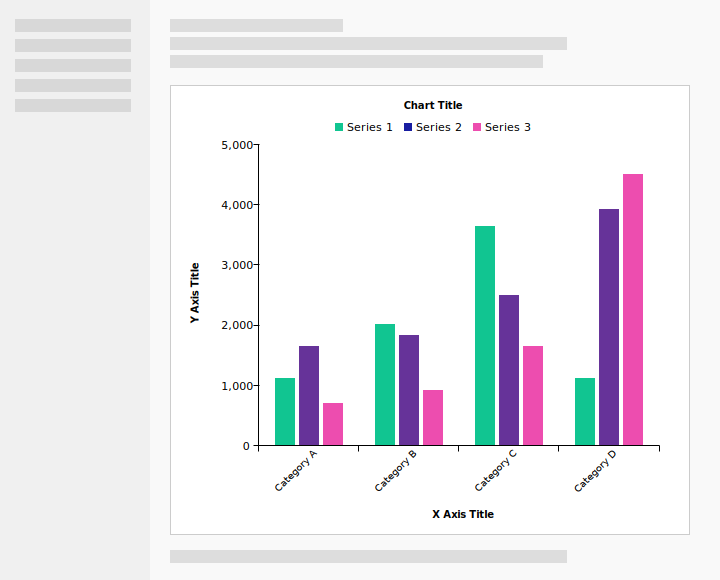
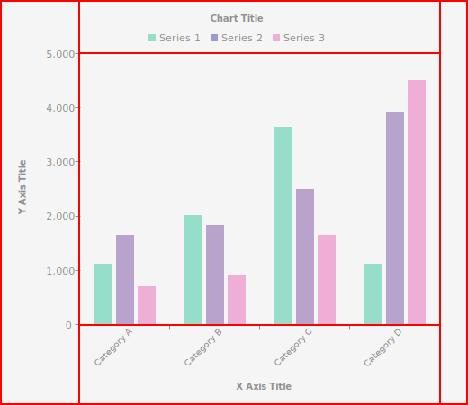
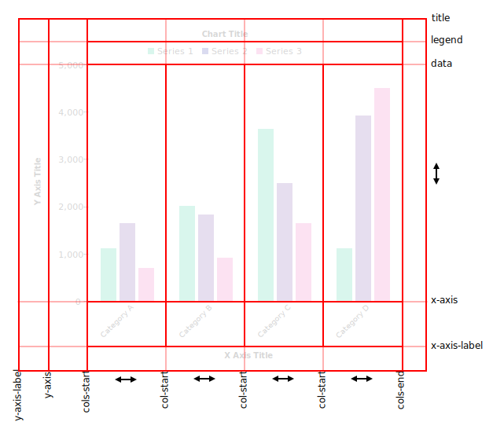

> Note: This tutorial is targeted at Angular 9, using the Ivy renderer, as this version fixes a number of CSS bugs, particularly relating to binding CSS custom properties.

When faced with a need to visualise data, many developers' first instinct is to reach for a 3rd-party charting library. There's nothing wrong with this: there are several robust and full-featured libraries out there, and it's usually smart to leverage existing, good quality code. But we shouldn't forget that Angular, coupled with modern CSS features, also provides a great base on which to create our own, bespoke visualisation components. Doing so gives us the ability to tailor them to our exact use-cases, and avoid the inevitable trade-offs and bloat that comes with trying to solve for the general case of visualisation and charting. Also, creating visualisation components is just plain fun.

In this article, we'll explore the process of creating a bar chart component for Angular. Even if you've created similar components before, the approach here might surprise you. We won't be rendering to a canvas element, or to dynamic SVG. We won't be using D3, or any dependencies besides those that come with a standard Angular CLI app. We won't be using any listeners or polling to detect resizes and run complex and flaky layout code. Instead, we'll strive to use modern CSS features, in particular grid and custom properties, to build the component's layout in a declarative and automatically responsive way.

The finished chart can be viewed in this [simple demo](https://jonrimmer.github.io/dynamic-bar-chart/demo/), or in a [more complex demo](https://jonrimmer.github.io/dynamic-bar-chart/).

The complete code for the chart and both examples can be [found on GitHub](https://github.com/jonrimmer/awesome-fullstack-tutorials/tree/master/angular/dynamic-visualisation-bar-chart/code)

## Scaffolding

The first thing to do is create our component. We can use Angular CLI's schematics to generate one for us:

```
ng generate @schematics/angular:component bar-chart --style=scss

CREATE src/app/bar-chart/bar-chart.component.scss (0 bytes)
CREATE src/app/bar-chart/bar-chart.component.html (24 bytes)
CREATE src/app/bar-chart/bar-chart.component.spec.ts (643 bytes)
CREATE src/app/bar-chart/bar-chart.component.ts (281 bytes)
UPDATE src/app/app.module.ts (717 bytes)
```

## Data Model

In a theoretical sense, we can consider our component as a function that maps from its inputs to a rendered output (i.e., the chart). So, let's start by identifying what the input data should look like by defining some TypeScript interfaces inside `bar-chart.component.ts`:

```ts
interface BarChartSeries {
  label: string;
  color: string;
}

export interface BarChartCategory {
  label: string;
  values: number[];
}
```

Our chart's raw data will be stored in this structure, and supplied to our component using `@Input()` properties that we'll define in the `BarChartComponent` class in `bar-chart.component.ts`:

```ts
@Input()
series: BarChartSeries[];

@Input()
columns: BarChartColumn[];
```

We'll need to define some additional inputs later, for things like the chart title, but these will suffice for now.

## Basic Layout

Next we'll the basic layout structure of our component. We start with a simple mockup of our bar chart component, placed within the context of a skeleton app page:



### Inner and outer layout

When building components, it is important to think of layout in terms of "inner" — those aspects controlled by the component code itself — and "outer" — those controlled by the surrounding content.

In its most basic form, our component is just a box placed within another larger box (the page):


Everything that goes on inside the inner, purple box is the responsibility of the component, but it should make few or no assumptions about the size and position of the box within the larger layout. Instead, it should adapt to the size of its container. This will make it more generic, and more easily re-usable in different situations and contexts.

### Inner layout

By leaving the positioning and sizing of our component up to its consumer, the dimensions of our component's layout box become an input, as important (and unknown) as the data we'll be showing as columns, series and categories. We could read these dimensions explicitly from the DOM and calculate our entire layout in JavaScript, but this is difficult to do in a truly performant and bulletproof way (although [CSS Houdini](https://ishoudinireadyyet.com/)'s Layout API may change this, when it arrives).

To achieve a responsive inner layout without having to calculate everything ourselves, we will use CSS Grid layout. The design our grid, we begin by breaking up the mocked-up content into sections:



We can see that, in essence, our component consists of five areas:

1. The title and legend
2. The _y_ axis
3. The _x_ axis
4. The central data
5. A right-side spacer

The next step is to break the layout up further, into the rows and columns of our layout grid, which we then define in `bar-chart.component.scss`. Since we want our component to be responsive. We also need to consider how these will be sized relative to the total available space. CSS grid provides a great deal of scope of how a row or columns can be sized. But at a high–level, there are four strategies:

1.  Give it a fixed size
2.  Size it to fit its content
3.  Make it proportional to the overall size of the component
4.  Make it flexibly fill any available space

It is this ability to control the sizing strategy of different sections of our component that makes using grid such a compelling alternative over rendering to canvas or SVG. Even though SVG is responsive in the sense of being scalable to any size without losing detail, its positioning system is extremely primitive, making it impossible to create truly responsive visualisations in a declarative way.

Now let's break our design down further, into rows and columns:



Note that we will be using grid's named-lines capability to identify important offsets in our grid. This is important to make the CSS we write for each section structurally independent of the rest of the grid. In contrast, hardcoding exact row and column offsets makes it much harder to modify the grid structure later, if we want to introduce a new element, such as a row of controls.

We have a fixed set of five rows, and they can be defined as follows:

```css
:host {
  display: grid;
  grid-template-rows:
    [title] auto [legend] auto [data] minmax(10em, 1fr)
    [x-axis] auto [x-axis-label];
}
```

Note that only one of our rows, the data row, will be fully flexible. The others will size to fit their content instead.

We are also using the `minmax(...)` function to give the flexible row a minimum and maximum size. In this, case we give a small minimum of `10em`, to ensure that the data at least remains visible, while letting the data row grow as large as it can with a `1fr` maximum.

Defining the columns of our grid is more complicated, as there will be a dynamic number of them. Fortunately CSS grid provides for this situation.

```css
:host {
  // ...
  grid-template-columns: [y-axis-label] auto [y-axis] auto
    [cols-start] repeat(var(--column-count)), [col-start] minmax(5em, 1fr))
    [cols-end] 1em;
}
```

Here we're using a `repeat(...)` function expression to specify the dynamic data columns. Let's look at it isolation:

```css
repeat(var(--column-count), [col-start] minmax(5em, 1fr))
```

The `repeat(...)` expression indicates that we would like to repeat the following column definition some number of times. This can be a static number, but in our case the repeat count is a CSS custom property/variable, called `--column-count`. This variable is the bridge between our component and its stylesheet, and we'll see later how it can be supplied by the JavaScript code.

The `[col-start]` gives each repeated column a name. These names don't have to be unique, as we can specify one by supplying an index with the name, e.g., `col-start 1`, `col-start 2`, etc. This lets us place content in a particular column without worrying about the rest of the grid's details.

Finally, `minmax(5em, 1fr)` makes each column size between a minimum of `5em` and an unbounded maximum, similarly to how we constrained the data row. Because there may be more than one column, any available space will be shared equally between them.

## Chart Content

With the grid structure of our component defined, we can begin adding the content. We'll progress through each piece of content:

### Title

We'll start simple, with the chart title. We can add a new input to configure this:

```ts
@Input()
title: string;
```

And, if it's set, we'll bind it to an element in the component template:

```html
<div *ngIf="title" class="title">{{ title }}</div>
```

And finally we can add some styles for this element:

```css
.title {
  grid-row: title;
  grid-column: 1 / -1;
  justify-self: center;
}
```

> Note: We'll make an exception to our named-lines policy here, as the title needs to span the whole grid, meaning its easiest just to define as spanning from column `1` to the last: `-1`.

### Legend

The legend displays a key of the chart series. We already have an input for this, so we now need to render it into our template:

```html
<ol class="legend">
  <li class="legend-item" *ngFor="let s of series" [style.--color]="s.color">
    {{ s.label }}
  </li>
</ol>
```

Here we see our first use of a CSS custom property, `--color`, which we're binding to the value of the `color` field of the series. This lets us pass a value from the JS realm into CSS, where we can use it in place of a static value:

```css
.legend-item::before {
  display: inline-block;
  content: '';
  background-color: var(--color);
  // Etc.
}
```

Here we've used it as the background color of a pseudo element. This wouldn't be possible with a regular style attribute binding, and we'd have to introduce an additional element into our HTML. This approach keeps our markup simple.

> Note: If you're using Angular 8, there is a bug with binding [CSS custom properties](https://github.com/angular/angular/issues/9343). It is possible to work around this issue by manipulating the underlying DOM element directly. I recommend writing a custom directive to do so, the API of which could look something like this:
>
> ```html
> <li class="legend-item" [appCssProps]="{ color: s.color }">
>   {{ s.name}}
> </li>
> ```

Custom properties help us develop a clean abstraction between the component's JS, template, and stylesheet. The template is only responsible for binding a single, domain-specific value, which the stylesheet bind to whichever elements and properties it wants, without the knowledge of the JS or template.

### Categories

Now we come to the heart of our grid, the categories.

#### CSS Custom Properties

The final piece of our CSS grid configuration is to supply the `--category-count` CSS property we used earlier in the `grid-template-columns` definition. As this is declared on the host element, we can't bind it in the template. Instead, we can use a host-binding in the component class:

```ts
@HostBinding('style.--category-count')
public get categoryCount() {
  return this.categories.length;
}
```

We also want to calculate and bind another property: `---maxValue`. This will let us communicate to CSS

#### Category Templates

Recall that our category data structure looks like this:

```ts
export interface BarChartCategory {
  label: string;
  values: number[];
}
```

For each category, we need to render both `values` array, as coloured bars in the data area, and its `label` property, in the axis area. We'll begin with a single loop over the `categories` field:

```html
<ng-container *ngFor="let category of categories; index as ci">
  <!-- TODO: Category data does here -->
  <!-- TODO: Category labels go here -->
</ng-container>
```

> Note: We've declared our `ngFor` on a `ng-container`, rather than an element. When using CSS grid, we need to keep our markup as flat as possible, because items can only be placed within a grid belonging to their parent element. In future, we will be able to achieving more hierarchical nesting using CSS sub-grids or `display: contents`, but at the moment neither of these features have sufficient cross-browser support.

#### Data Bars

For the category `values`, we'll render `.category` div with a nested `ngFor` to output a `.bar` for each value:

```html
<ng-container *ngFor="let column of columns; index as ci">
  <div class="category" [style.grid-column]="'col-start ' + (ci + 1)">
    <div
      class="bar"
      *ngFor="let value of category.values; index as di"
      [style.--value]="value"
      [style.--color]="series[di].color"
    ></div>
  </div>
  <!-- TODO: Category labels go here -->
</ng-container>
```

We move the `.category` div into the correct position by binding its `grid-column` style to a string of the form `col-start {i+1}`. This ensures it will be placed into the correct repeated column.

For each `.bar` we won't bind any styles directly. Instead, we'll supply two CSS variables: `--value`, which contains the raw frequency value from the `values` array, and `--color`, which contains the series color from the `series` field. We'll use both in the component stylesheet:

```css
.category {
  grid-row: data;
  display: flex;
  align-items: flex-end;
}

.bar {
  flex: 1;
  background-color: var(--color);
  height: calc(var(--value) / var(--max-value) * 100%);
  margin: 0 1px;
}
```

The `.category` div is a flex container that aligns its items to the end, which is equivalent to aligning their bottom end to the _x_ axis line.

Here we're using the `--color` property as the background color. However, by abstracting it using a property, we could have media queries to change how it is used, such as applying it as an outline when printing, without requiring a change to the template.

The `--value` property is being used in a `calc(...)` function to determine the height of the bar. By dividing it by a second, `--max-value` property, then multiplying it by 100%, we can scale the height of the `.bar` in a declarative way.

In order to supply `--max-value`, we can use setter function on `categories` to calculate and bind it:

```ts
public categories: BarChartCategory[] = [];

@HostBinding('style.--max-value')
public maxValue = 1;

@Input('categories')
public set categoriesInput(value: BarChartCategory[]) {
  if (!value) {
    return;
  }

  this.categories = value;
  this.maxValue = Math.max(...value.flatMap(c => c.values));
}
```

> Note: Using the simple maximum may not produce the most elegant _y_ axis scale. We'll improve on this later.

#### Category Labels

When dealing with unknown data, text labels are a real source of pain. Long labels can easily overflow the container. On a bar chart, the best approach for _x_ axis labels is usually to rotate them at a 45-degree angle. This prevents them overflowing into each other, while being more readable and space efficient than 90-degree labels.

```html
<ng-container *ngFor="let category of categories; index as ci">
  <!-- ... -->
  <div
    class="category-label-container"
    [style.grid-column]="'col-start ' + (ci + 1)"
  >
    <div class="category-label">
      <div class="label-text">
        {{ category.label }}
      </div>
    </div>
  </div>
</ng-container>
```

To rotate the labels, we can use CSS transforms:

```css
.category-label {
  transform-origin: top right;
  transform: translateX(-50%) rotate(-45deg);
  text-align: right;
}
```

However, CSS transforms are not taken into account for layout purposes. The _y_ axis area will be sized as if all the labels were unrotated, giving it a single-line height, and meaning these labels will overflow the bottom of the container.

To prevent this, we can use `padding-bottom` and a bit of trigonometry. Because percentage padding is always calculated based on an element's width, we can use it on the `.label-text` wrapper to make each label's height proportional to its width. And trigonometry tells use that a horizontal line rotated to 45-degrees covers approximately 70% of its length in the vertical direction. Therefore, a `padding-bottom: 70%` value on each `.label-text` will ensure the _y_ axis area is always large enough to contain the rotated labels.

### _Y_ Axis

Since we don't know the range of the data, we face the problem of producing a range and ticks for the _y_ axis. Our options are:

1. Leave it up to the component consumer by exposing inputs like `tickCount` and `tickSize`.
2. Use the simple minimum and maximum values of the data and a fixed number of evenly-spaced ticks, even if it produces ugly tick values "342.63", etc.
3. Try to generate good-looking labels automatically.

In our implementation, we'll attempt the third choice using an algorithm invented by Paul S. Heckbert for generating "nice" axis labels. The approach was first detailed by Heckbert in the book Graphics Gems, and it works based on the observation that power-of-ten multiples of 1, 2 or 5 tend to look best.

Check the example project for the complete implementation. But, the end result is a function `niceTicks(min, max, tickCount): number[]` that we can use in our categories setter:

```ts
const values = value.flatMap(c => c.values);

const minValue = Math.min(...values);
const maxValue = Math.max(...values);

this.yTicks = [...niceTicks(minValue, maxValue, 10)];
this.maxValue = this.yTicks[this.yTicks.length - 1];
```

We render the _y_ axis ticks in the template using another `*ngFor` loop:

```html
<div class="y-axis">
  <div class="y-tick" *ngFor="let tick of yTicks">
    <div class="y-tick-value">
      {{ tick | number }}
    </div>
  </div>
</div>
```

To correctly layout the ticks along the length of the `y-axis` container, we'll use a vertical flexbox with `space-between` justification and a reverse order:

```css
.y-axis {
  display: flex;
  flex-direction: column-reverse;
  justify-content: space-between;
  align-items: flex-end;
}
```

However, the intrinsic height of the `.y-tick` boxes will prevent them being at exactly the right location. We can solve this by setting the `.y-tick` height to zero, and applying a CSS transform to move the nested `.y-tick-value` box into place:

```css
.y-tick {
  height: 0;
}

.y-tick-value {
  transform: translateY(-50%);
}
```

By avoiding the use of absolute positioning on the ticks, we ensure that the width of the `.y-axis` container is still calculated based on the width of the labels, and will be sized correctly without any need to perform JS-based measurement of the element sizes.

All that remains is to complete the styling of the axis and the ticks using CSS borders and pseudo elements for the tick marks themselves.

## Finishing Up

We now have the essentials of laying out of chart done. However, we're not yet done. There's still a bit of work to tidy up the styling–applying margins, padding and colours to various elements until we have an attractive looking chart. The nature of this work depends upon the particular look you're trying to achieve, but you can examine the example project for a possible example. It is useful to define sizes, such as margins and padding, using `em` values, so they scale in proportion to the font size. This gives the component consumer an easy way to scale the chart's text and internal sizes using just the `font-size` CSS property.

### Taking It Further

At this point we have a working bar chart component that responds flexibly both to different data sources, and the size constraints applied to it by its surrounding layout container. If we were to continue to develop it, there's many more features we could add, such as templated columns, better handling of over-sized tick and category labels, or display-mode controls for stacked and scaled bars. The possibilities are endless, although we should always be careful to evaluate the additional complexity each feature introduces into our codebase against the value it provides.

## About the Author

Jon Rimmer is a software developer who lives and works in London.
