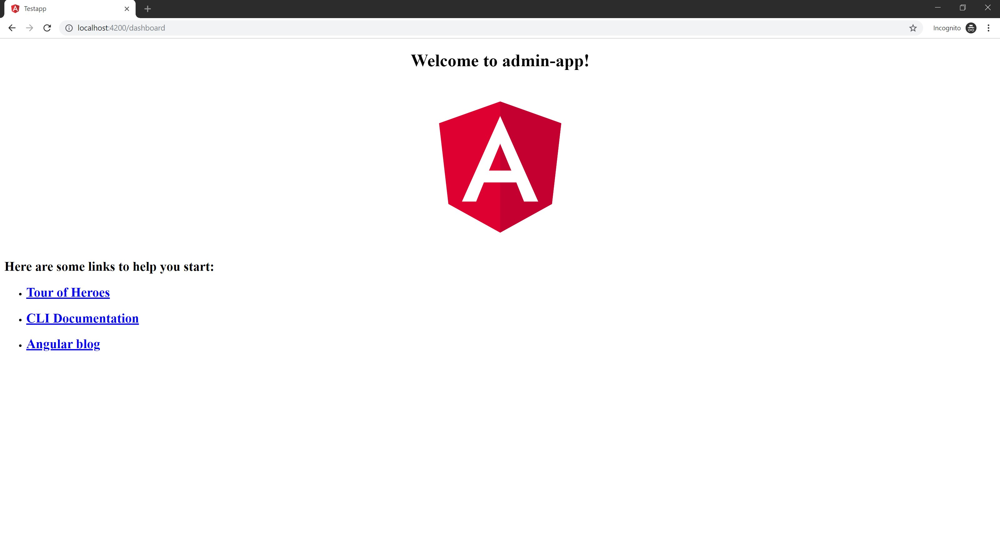
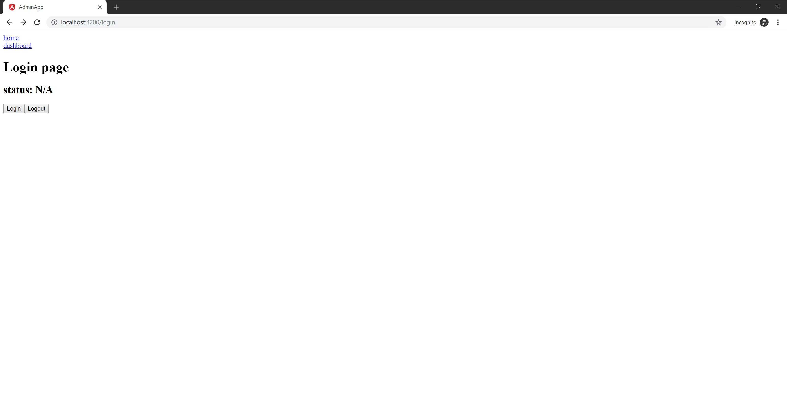
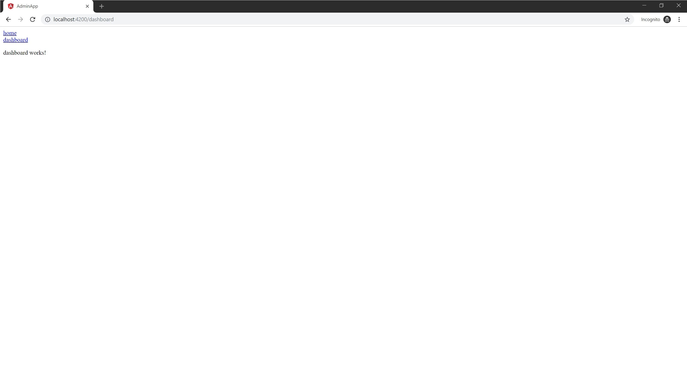

# How To Protect Routes In Angular

A great way to take your app to the next level is to implement Angular's guards. Guards are interfaces that protect routes and grant access based on defined permissions.  This is useful for apps with an admin dashboard. 

Think of a CMS like WordPress where a user can access the dashboard once logged in.

## What you will learn

- what are guards
- how to create a guard
- best way to handle routing

## Table of Contents

- Create An App
- Create Components
- Setup Routing
  - Create an Array of Routes
  - Implement the RouterModule
  - Update App Component
- Update Login Component
- Create A Guard
- Create a Service
- Update Guard
- Update Login Component Again
- Protect Dashboard Route
- Summary
- References


## Create An App

Using the CLI make a new app, in this example `<app-name>` will be `admin-app`:

```
ng new <app-name>
```

Once our new app is generated run the app:

```
ng serve
```

or

```
 npm start
 ```

Next visit the app on the browser at [localhost:4200](http://localhost:4200) and you should see this.


Now that we know our app is working we can begin to build our components.

## Create Components

We need two components:

- `Dashboard` - Our component we'll protect from users with no permission.
- `Login` - Our component that will grant user permission to access the dashboard component.

Generate the two components:
```
ng generate component login

ng generate component dashboard
```

The CLI will automatically add our components to the appModule.

```typescript

import { BrowserModule } from '@angular/platform-browser';
import { NgModule } from '@angular/core';

import { AppComponent } from './app.component';
import { LoginComponent } from './login/login.component';
import { DashboardComponent } from './dashboard/dashboard.component';

@NgModule({
  declarations: [
    AppComponent,
    LoginComponent,
    DashboardComponent
  ],
  imports: [
    BrowserModule,
  ],
  providers: [],
  bootstrap: [AppComponent]
})
export class AppModule { }

```
*contents of app.module.ts*


## Setup Routing

Let's create a routing module to handle what components a user will see when browsing our app.

Create a module named `app-routing`

```
ng generate module app-routing --flat --module=app
```

*`--flat` option will only generate a file instead of a folder. and it will be on the base level.*

*`--module` option is to tell the cli which module to register the new module to. in this example it is the 'app' module.*

The generated file `app-routing.module.ts` will look like this:

```typescript

import { NgModule } from '@angular/core';
import { CommonModule } from '@angular/common';

@NgModule({
  imports: [
    CommonModule
  ],
  declarations: []
})
export class AppRoutingModule { }

```

### Create an Array of Routes

In the `app-routing.module.ts` file import the `Login` and `Dashboard` components. Also import the `RouterModule`, and `Routes` from `@angular/router` library.

```typescript
import { RouterModule, Routes } from '@angular/router';
import { LoginComponent } from './login/login.component';
import { DashboardComponent } from './dashboard/dashboard.component';
```

Now that we have our components imported next create an array of objects named `routes` of type `Routes`. Each object is a route with a path and a component to render to that path.

```typescript
const routes: Routes = [
  { path: 'login', component: LoginComponent },
  { path: '', redirectTo: '/login', pathMatch: 'full' },
  { path: 'dashboard', component: DashboardComponent},
];
```
*keep in mind the order of the paths matters as the first one matched will be rendered.*

Our path value is which url path the component will render to. An empty path `''` is used alongside the property `redirectTo` with a value of `/login` and the property `pathMatch` with the value `full` to tell the browser to re-direct the user to the login path if the url path is empty.

### Implement the RouterModule

We want our router to be configured at the app's root level. To do so we'll use the `forRoot()` method from `RouterModule`.

Inject the `RouterModule` to the `@NgModule()` metadata imports array and pass the `routes` array into `forRoot()`:

```typescript
@NgModule({
  imports: [
    CommonModule,
    RouterModule.forRoot(routes)

  ],
  declarations: []
})
```

Export `RouterModule` so that the `AppModule` can utilize the `router-outlet` directive and other directives including service providers anywhere in the app.

```typescript
@NgModule({
  imports: [
    RouterModule.forRoot(routes)
  ],
  exports: [RouterModule]

})
```

The `app-routing.module.ts` file will look like this completed.

```typescript
import { NgModule } from '@angular/core';
import { RouterModule, Routes } from '@angular/router';
import { LoginComponent } from './login/login.component';
import { DashboardComponent } from './dashboard/dashboard.component';

const routes: Routes = [
  { path: 'login', component: LoginComponent },
  { path: '', redirectTo: '/login', pathMatch: 'full' },
  { path: 'dashboard', component: DashboardComponent,},
];

@NgModule({
  imports: [
    RouterModule.forRoot(routes)
  ],
  exports: [RouterModule]

})
export class AppRoutingModule { }

```
*Notice the CommonModule and declarations are removed since they are unused. It's good practice to remove what you don't use. This keeps code bloat to a minimum.*

Make sure the `AppModule` has the `AppRoutingModule` imported. The file should look like this.

```typescript
import { BrowserModule } from '@angular/platform-browser';
import { NgModule } from '@angular/core';

import { AppComponent } from './app.component';
import { LoginComponent } from './login/login.component';
import { AppRoutingModule } from './app-routing.module';
import { DashboardComponent } from './dashboard/dashboard.component';

@NgModule({
  declarations: [
    AppComponent,
    LoginComponent,
    DashboardComponent
  ],
  imports: [
    BrowserModule,
    AppRoutingModule
  ],
  providers: [],
  bootstrap: [AppComponent]
})
export class AppModule { }

```

If we visit the browser and navigate to our paths notice that nothing changes. Why is that?



We've missed one crucial step, which is implementing the `router-outlet` directive.

### Update App Component

Let's open the `app.component.html` file, replace all its content with the `router-outlet` and simple navigation to our login and dashboard routes.

The app's template should look like this:
```typescript
<nav>
  <a routerLink="login">home</a>
  <br>
  <a routerLink="dashboard">dashboard</a>
</nav>
<router-outlet></router-outlet>
```

*we are able to use `routerLink` thanks to the RouterModule*

Once that's done we can visit each of our paths directly in the browser.

The next thing to do is to update the Login component.

## Update Login Component

We can now see our components render to the browser.
Let's stub out functionality. Stubbing is like blueprinting. We add placeholder functionality as a guide which helps in debugging.

What we want is for the login component to handle access to our dashboard by granting the user permission via a guard (more on this later).

Update the `login.component.ts` file:
```typescript
import { Component, OnInit } from '@angular/core';

@Component({
  selector: 'app-login',
  templateUrl: './login.component.html',
  styleUrls: ['./login.component.css']
})
export class LoginComponent implements OnInit {

  message = 'status: N/A' ;

  constructor() {
  }

  ngOnInit() {

  }


  login() {
    this.message = 'status: logged in'
  }

  logout() {
    this.message = 'status: logged out'
  }

}
```

Update the `login.component.html` file:
```typescript
<div>
  <h1>Login page</h1>
  <h2>{{ message }}</h2>

  <div>
    <button (click)="login()" >Login</button>
    <button (click)="logout()">Logout</button>
  </div>
</div>

```

What we've done is to interpolate a simple message that is attached to the two buttons click events that call our methods: `login()` and `logout()`



We'll revisit the login component later to integrate the guard we're creating next.

## Create A Guard

Guards are interfaces that return a promise< boolean >, observable< boolean >, a boolean, or a UrlTree.

There are multiple types of guards:

- `CanActivate` -controls access to a route.
- `CanActivateChild` - controls access to a child route.
- `CanDeactivate` - mediate navigation away from the current route.
- `Resolve` - perform route data retrieval before route activation.
- `CanLoad` - mediate navigation to a feature module loaded async.

Create a new guard named `auth` inside a new folder auth.

```
ng generate guard auth/auth
```

By default our newly generated guard implements the CanActivate guard interface.

```typescript

import { Injectable } from '@angular/core';
import { CanActivate, ActivatedRouteSnapshot, RouterStateSnapshot } from '@angular/router';
import { Observable } from 'rxjs';

@Injectable()
export class AuthGuard implements CanActivate {
  canActivate(
    next: ActivatedRouteSnapshot,
    state: RouterStateSnapshot): Observable<boolean> | Promise<boolean> | boolean {
    return true;
  }
}
```

The file `auth.guard.ts` contains a method `canActivate()` that accepts the parameters: next, and state and returns a boolean.

Go to the `app-routing.module.ts` file and import the newly created guard to our routing module.

Tie the imported guard to the route we want protected which is the dashboard route.

```typescript
import { NgModule } from '@angular/core';
import { RouterModule, Routes } from '@angular/router';
import { LoginComponent } from './login/login.component';
import { DashboardComponent } from './dashboard/dashboard.component';
import { AuthGuard } from './auth/auth.guard';

const routes: Routes = [
  { path: 'login', component: LoginComponent },
  { path: '', redirectTo: '/login', pathMatch: 'full' },
  { path: 'dashboard', component: DashboardComponent, canActivate: [AuthGuard] },
];

@NgModule({
  imports: [
    RouterModule.forRoot(routes)
  ],
  exports: [RouterModule]

})
export class AppRoutingModule { }

```

Next we need to update our guard with specific conditions. These conditions we'll create through a service.

## Create a Service

we are making a service to mock authentication conditions.
our guard will call the service to login a user and retain that user's information.

generate a service named `auth` in the auth folder
```
ng generate service auth/auth
```

We now have a bare-bones service file.


Update the service:

```typescript
import { Injectable } from '@angular/core';
import { Observable, of } from 'rxjs';

@Injectable({
  providedIn: 'root',
})
export class AuthService {
  isLoggedIn = false;
  redirectUrl: string;

  login(): Observable<boolean> {

  }

  logout(): void {
  }
}

```

We have created a login method as an observable, a logout method, a boolean flag `isLoggedIn` and a string variable `redirectUrl`.

Import the operators `tap` and `delay` from `rxjs/operators`.

Update the login method to return an emitted value of true. This will simulate an API call. 

Add a pipe method and use `tap` after a 1sec delay to toggle the `isLoggedIn` flag to true.

In the logout method toggle the `isLoggedIn` flag to false.

```typescript
import { Injectable } from '@angular/core';
import { Observable, of } from 'rxjs';
import { tap, delay } from 'rxjs/operators';

@Injectable({
  providedIn: 'root',
})
export class AuthService {
  isLoggedIn = false;
  redirectUrl: string;

  login(): Observable<boolean> {
    return of(true).pipe(
      delay(1000),
      tap(val => this.isLoggedIn = true)
    );
  }

  logout(): void {
    this.isLoggedIn = false;
  }
}
```

Our service is now ready to perform a login authentication. Let's implement it in our guard.

## Update Guard

Now that we have a service we can use its functionality in our guard.

Import our newly created `AuthService` and inject it in the constructor along with `Router`.

Update the `auth.guard.ts` file to this:

```typescript
import { Injectable } from '@angular/core';
import { CanActivate, ActivatedRouteSnapshot, RouterStateSnapshot, Router } from '@angular/router';

import { AuthService } from './auth.service';

@Injectable({
  providedIn: 'root',
})
export class AuthGuard implements CanActivate {
  constructor(private authService: AuthService, private router: Router) {}

  canActivate(
    next: ActivatedRouteSnapshot,
    state: RouterStateSnapshot): boolean {

    return this.checkLogin(state.url);
  }

  checkLogin(url: string): boolean {
    if (this.authService.isLoggedIn) { return true; }
    this.authService.redirectUrl = url;

    this.router.navigate(['/login']);
    return false;
  }
}

```

The changes made are:

- A new method `checkLogin()` which accepts a url string. The method returns true if the isLoggedIn flag from the AuthService is `true`, sets the redirectUrl from the AuthService to the passed in url then navigates to the login path and returns false.
- The `canActivate()` method now returns a call to `checkLogin()` which accepts a url string from the parameter `state` which will be the previous route the user came from if the guard check is false, not permitting the user to be logged in.

we can now update our login component and tie in the new functionality.

## Update Login Component Again

Currently our file `login.component.ts` looks like this:

```typescript
import { Component, OnInit } from '@angular/core';

@Component({
  selector: 'app-login',
  templateUrl: './login.component.html',
  styleUrls: ['./login.component.css']
})
export class LoginComponent implements OnInit {

  message = 'status: N/A' ;

  constructor() {}

  ngOnInit() {

  }

  login() {
    this.message = 'status: logged in'
  }

  logout() {
    this.message = 'status: logged out'
  }

```

import `AuthService` and `Router` then inject it to the constructor.
Add a check to `isLoggedIn` in the `ngOnInit()` lifecycle hook.

Update the login method to subscribe to the login observable from our `AuthService`.

Inside this we check the `isLoggedIn` flag and if it's true we redirect to the dashboard route and toggle our message.

Update the logout method to call the logout method from the `AuthService` which logs our user out, effectively protecting the dashboard route.

```typescript
import { Component, OnInit } from '@angular/core';
import { AuthService } from '../auth/auth.service';
import { Router } from '@angular/router';

@Component({
  selector: 'app-login',
  templateUrl: './login.component.html',
  styleUrls: ['./login.component.css']
})
export class LoginComponent implements OnInit {

  message = 'status: N/A' ;

  constructor(public authService: AuthService, public router: Router) {
  }

  ngOnInit() {
    if(this.authService.isLoggedIn) {
      this.message = 'status: logged in'
    }
  }


  login() {
    this.authService.login().subscribe((res) => {
      console.log(this.authService.isLoggedIn, {res})

      if (this.authService.isLoggedIn) {
        const redirect = this.authService.redirectUrl ? this.router.parseUrl(this.authService.redirectUrl) : 'login';
        this.message = 'status: logged in'

        this.router.navigateByUrl(redirect);
      }
    });
  }

  logout() {
    this.authService.logout();
    this.message = 'status: logged out'
  }

}

```

## Protect Dashboard Route

The last thing for us to do is is add our guard to the dashboard route.

Go to the `app-routing.module.ts` file.

Import our `AuthGuard` then add it to the dashboard route like so:

```typescript
{ path: 'dashboard', component: DashboardComponent, canActivate: [AuthGuard] }
```

our file should look like this:

```typescript
import { NgModule } from '@angular/core';
import { RouterModule, Routes } from '@angular/router';
import { LoginComponent } from './login/login.component';
import { DashboardComponent } from './dashboard/dashboard.component';
import { AuthGuard } from './auth/auth.guard';

const routes: Routes = [
  { path: 'login', component: LoginComponent },
  { path: '', redirectTo: '/login', pathMatch: 'full' },
  { path: 'dashboard', component: DashboardComponent, canActivate: [AuthGuard] },
];

@NgModule({
  imports: [
    RouterModule.forRoot(routes)
  ],
  exports: [RouterModule]

})
export class AppRoutingModule { }
```
And that's it! The dashboard route is successfully protected!

Visit the app in the browser and try to visit the dashboard without logging in.



*Our user is now able to access the protected dashboard app by clicking 'login'*

## Summary

Protecting routes in Angular is extremely helpful. There multiple approaches to protecting routes are other guards. Visit the references below and test out different ways. You can also play around with the codebase linked below.

## References
- [final codebase](https://stackblitz.com/edit/angular-routing-post?embed=1&file=src/app/app-routing.module.ts)
- [angular router](https://angular.io/guide/router)
- [angular cli](https://angular.io/cli/generate)
- [Using Angular Route Guard For securing routes](https://codeburst.io/using-angular-route-guard-for-securing-routes-eabf5b86b4d1)
- [Basic Routing In Angular](https://blog.ng-book.com/basic-routing-in-angular-2/)
